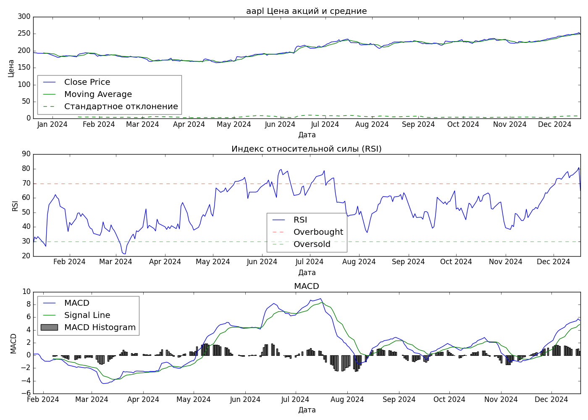
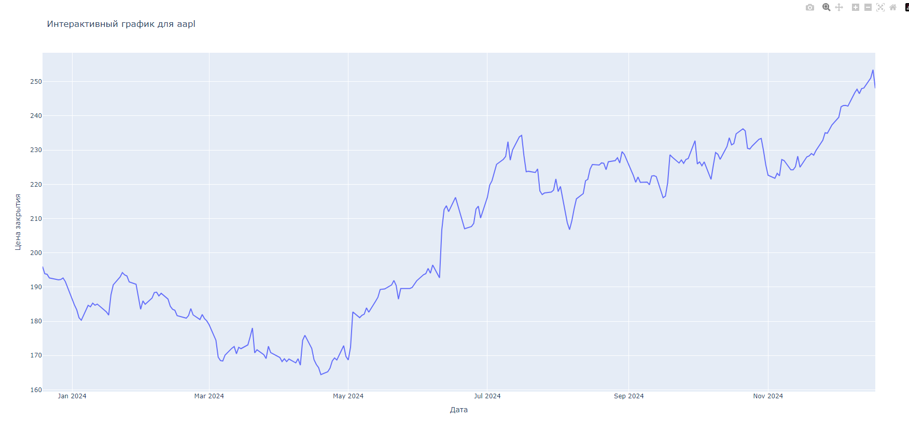

# Stock Analysis Project

Этот проект предназначен для анализа данных
о ценах акций с использованием 
библиотеки `yfinance`. 
Он включает в себя функции для
создания графиков, вычисления средней цены
и уведомления о сильных колебаниях цен, а также данные
технического анализа MACD b RSI.
Кроме стандарнтных периодов можно задать точные 
даты начала и окончания анализа.

## Установка

Для работы с проектом необходимо установить следующие зависимости:

- Python
- matplotlib
- pandas
- yfinance
- ta

Установите зависимости с помощью pip:


``` pip install matplotlib pandas yfinance``` 

## Использование

### Функции:

#### 1. create_and_save_plot(data, ticker, period, filename=None)

Создает и сохраняет график изменения цены акций за указанный период.

- data: DataFrame — данные о ценах акций.
- ticker: str — тикер акций (например, "AAPL").
- style: str - стиль графика по умолчанию classic
- filename: str, optional — имя файла для сохранения графика.

Визуализация

Графики показывают:

- **Цена закрытия и скользящая средняя**
- **Индекс относительной силы (RSI)**
- **MACD и его гистограмма**
- Пример - 

#### 2. calculate_and_display_average_price(data)

Вычисляет и отображает в консоли среднюю цену закрытия акций за указанный период.

- data: DataFrame — данные о ценах акций.

#### 3. notify_if_strong_fluctuations(data, threshold)

Уведомляет пользователя, если цена акций колебалась больше, чем на заданный процент.

- data: DataFrame — данные о ценах акций.
- threshold: float — порог изменения в процентах для уведомления.

#### 4. export_data_to_csv(data, filename)

Экспортирует данные акций в CSV файл.

- data: DataFrame, содержащий данные о цене акций.
- filename: Имя файла для сохранения.

#### 5. create_interactive_plot(data, ticker)

Рисует в браузере интерактивный график

- data: DataFrame, содержащий данные о цене акций.
- ticker: str — тикер акций (например, "AAPL").
- Пример - 

Пример использования: 
``` 
import yfinance as yf
import pandas as pd

# Получение данных
ticker = "AAPL"
data = yf.download(ticker, period="1mo")

# Примеры вызова функций
create_and_save_plot(data, style, ticker)
calculate_and_display_average_price(data)
notify_if_strong_fluctuations(data, 10)
export_data_to_csv(data, f'{ticker}.csv')

``` 